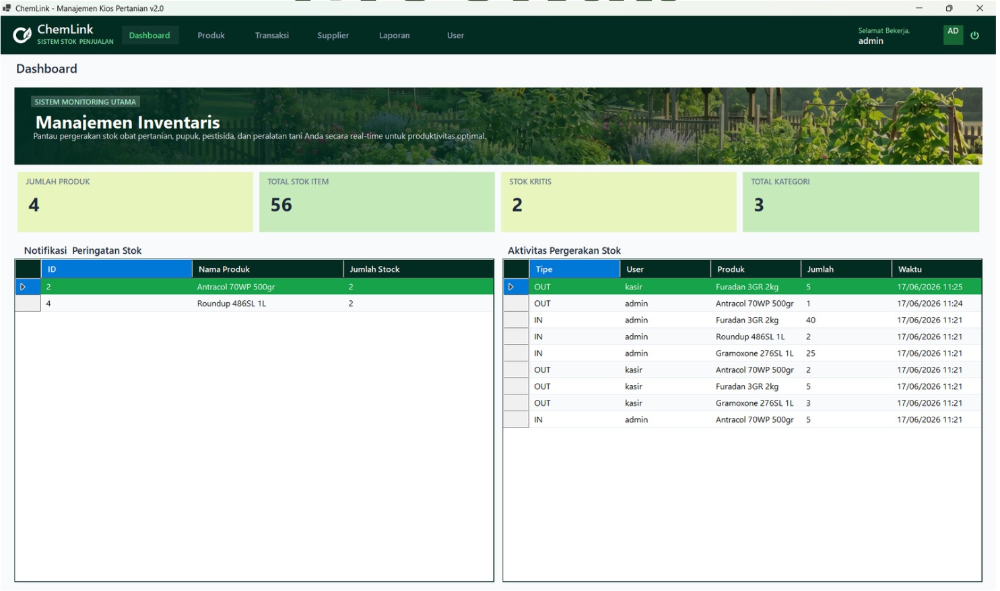
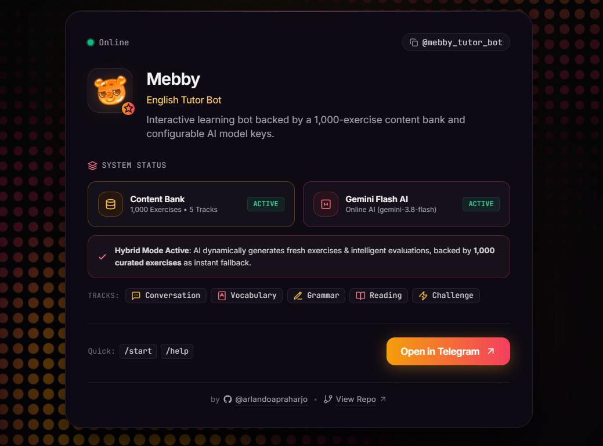
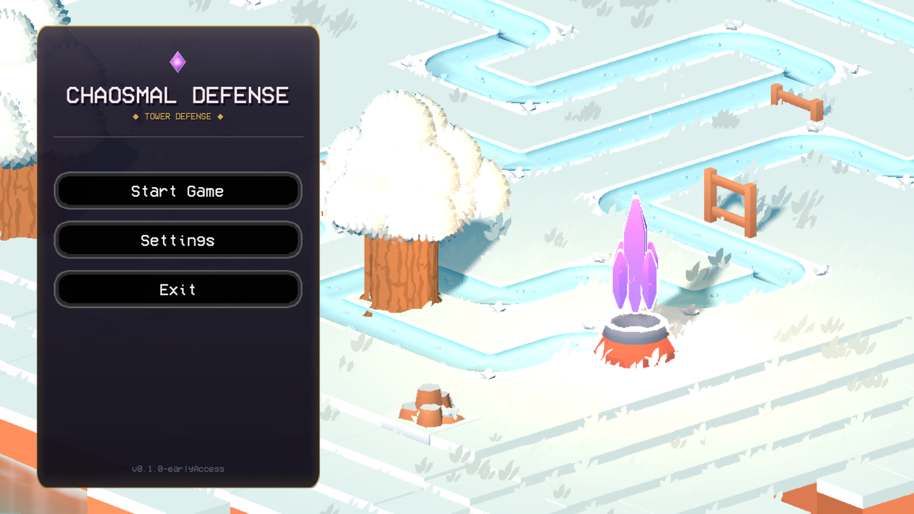

# Portfolio Website

A clean, responsive personal portfolio website showcasing game development and software engineering projects. Built with semantic HTML5, vanilla CSS3, and JavaScript, without external frameworks or dependencies.

## Featured Projects

### ChemLink
Agriculture inventory management and point-of-sale system with transaction tracking and stock monitoring.



Repository: [Chemlink](https://github.com/arlandoapraharjo/Chemlink)

### Mebby English Tutor Bot
Interactive Telegram learning bot powered by Gemini AI, backed by a 1,000-exercise curriculum across five learning tracks.



Repository: [mebby-telegram-bot](https://github.com/arlandoapraharjo/mebby-telegram-bot)

### Chaosmal Defense
Tactical 2D isometric tower defense game featuring strategic placement, wave-based enemy progression, and custom pixel art.



Repository: [chaosmal-defense-td](https://github.com/arlandoapraharjo/chaosmal-defense-td)

## Features

- Dark mode aesthetic with custom warm noir palette and atmospheric hero section
- Interactive 3D project cards with cursor-responsive perspective tilt and dynamic glare
- Client-side project pagination
- Mobile-responsive layout with animated navigation drawer
- Scroll-synchronized navigation highlighting and smooth anchor scrolling
- Lightweight and fast load performance with zero build tools required

## Tech Stack

- HTML5
- Vanilla CSS3
- Vanilla JavaScript

## Project Structure

```text
├── images/           # Project screenshots and visual assets
├── index.html        # Main HTML structure and semantic markup
├── styles.css        # Custom design system, typography, and responsive styles
├── scripts.js        # DOM interactions, tilt effects, and navigation logic
└── README.md         # Project documentation
```

